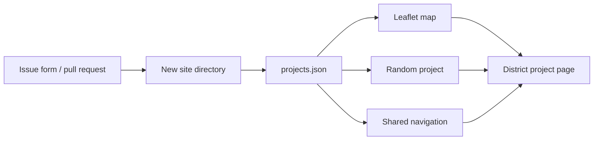

<div align="center">

<sub>Real photography by <a href="https://unsplash.com/photos/united-states-capitol-in-washington-dc-Os2kIaebMW8">Alejandro Barba on Unsplash</a>.</sub>

# Congressional App Challenge Showcase
### A map-driven, community-built gallery for student technology across congressional districts.


[Experience](#experience) · [Architecture](#architecture) · [Contribute](#add-your-project) · [Repository](#repository-map)
</div>

---

## Overview

Congressional App Challenge Showcase is a static, contribution-friendly platform for exploring student-built applications by congressional district. A Leaflet map reads centralized project metadata, routes visitors into self-contained participant pages, supports random and keyboard-based discovery, and gives contributors both issue-driven and pull-request submission paths.

The landing page also includes a web manifest, sitemap, robots file, Open Graph/Twitter metadata, canonical URLs, and structured `WebSite`, `Organization`, and `Event` data.

## Experience

- Interactive nationwide project map with district pins
- Individual pages under `sites/<district>/`
- Random-project discovery
- Left/right keyboard navigation between participant pages
- Reusable participant starter template
- GitHub issue forms for submissions and help
- Search/social metadata for public sharing
- Static hosting—no application server or database required

## Architecture



## Add your project

### Option A — submit an issue

Open **Issues**, choose **Add My Project**, and provide the requested app, creator, location, and demo information for maintainer review.

### Option B — contribute a page

1. Fork the repository.
2. Copy the participant template into `sites/XX-00/`, using the congressional-district slug.
3. Replace all `TODO` values and customize your page.
4. Add one record to `projects.json`.
5. Open a pull request.

Keep submissions under 5 MB, host large video externally, and modify only your page plus the required metadata record.

## Local preview

```bash
git clone https://github.com/TanishC4444/Congressional-Showcase.git
cd Congressional-Showcase
python -m http.server 8000
```

Visit `http://localhost:8000`. Serving over HTTP ensures JSON and navigation assets load consistently.

## Repository map

```text
Congressional-Showcase/
├── .github/issue_template/   project and support issue forms
├── assets/
│   ├── css/main.css
│   ├── js/map.js
│   └── js/nav.js
├── sites/                    participant project pages
├── template/                 reusable page starter
├── projects.json             canonical showcase metadata
├── index.html                landing page and map shell
├── manifest.json
├── sitemap.xml
└── robots.txt
```

## Engineering notes

| Decision | Advantage | Constraint |
|---|---|---|
| Static site | Fast, inexpensive, and fork-friendly | Metadata edits require a commit |
| Central JSON registry | Map, random selection, and navigation share one source | Schema validation is manual |
| Self-contained pages | Creators retain visual freedom | Consistency depends on shared template/navigation rules |
| External video | Keeps repository size manageable | Demo availability depends on third parties |

## Skills demonstrated

Community platform design · data-driven static sites · geospatial UI · contribution workflows · reusable templates · accessibility/navigation · SEO/social metadata · open-source governance

## Resume-ready highlight

> Built a nationwide civic-tech showcase that maps student applications by congressional district, generates navigation from shared JSON metadata, and supports scalable community contributions through reusable templates and issue-driven intake.

## License

MIT

